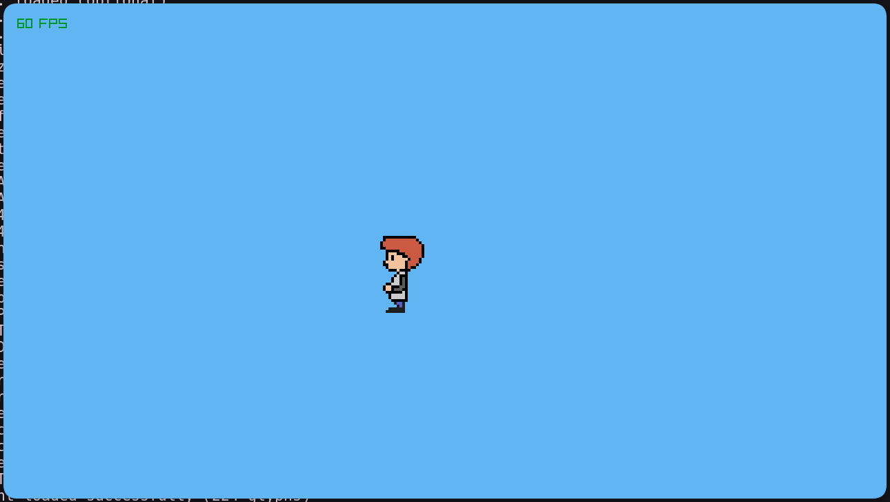

# Ray Engine

The Game + Engine for anyone to play.

A custom, high-performance 2D game engine built from scratch in modern **C++23** using the [Raylib](https://www.raylib.com/) library.



## Features
- **Modern C++23 Architecture:** Utilizes the latest C++ features including `std::expected` for robust error handling and `std::optional` for memory safety.
- **Entity System:** Clean Object-Oriented Entity system designed for simple inheritance and game loop management.
- **Auto-Discovery Build System:** Advanced CMake configuration that automatically detects new `.cpp` and `.hpp` files without manual CMakeLists edits.
- **Maximum Performance:** Configured for extreme speed using `-O3`, `-march=native`, `-ffast-math`, and **Link-Time Optimization (LTO)**.
- **Static Compilation:** Built-in support to compile highly portable binaries for easy sharing across Linux distributions.

## Directory Structure
- `include/`: Contains all header files (`.hpp`).
- `lib/`: Contains all source files (`.cpp`).
- `docs/`: Documentation and project images.
- `Main.cpp`: The application entry point.

## Building and Running

### Standard Build (Maximum Speed)
```bash
mkdir build && cd build
cmake ..
make
./GameRaylib
```
*Note: Any new files you add to `lib/` or `include/` will automatically be discovered by `make`. No need to re-run `cmake ..`!*

### Static Build (For Portability)
If you want to share your executable with other Linux users without them needing the exact same C++ runtime:
```bash
cd build
cmake ..
make static
./GameRaylib_static
```

## Dependencies
To build and run this engine, you must have the following exact dependencies installed:
- **CMake**: `v4.4.0` (or higher)
- **Raylib**: `v6.0.0` (Dynamic library via pkg-config)
- **GCC (GNU C++ Compiler)**: `v16.1.1` (Required for C++23 `std::expected` support)

## Controls
- **W, A, S, D**: Move Player
